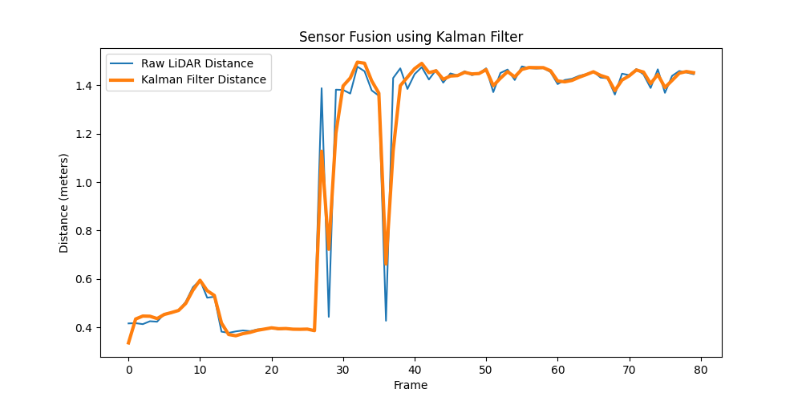

# 🚗 Multi-Sensor Data Fusion for Self-Driving Cars

## Using LiDAR, Camera, and Kalman

---

# 📌 Project Overview

This project demonstrates an advanced autonomous vehicle perception system by combining multiple sensors — **LiDAR** and **Camera** — along with a **Kalman Filter** for smooth and accurate object tracking.

Sensor fusion helps reduce uncertainty from individual sensors and provides a more reliable understanding of the surrounding environment, which is critical for safe self-driving operations.

This project simulates how modern autonomous vehicles perform real-time perception and tracking using multi-sensor data fusion techniques.

---

# 🌟 Features

✅ Multi-Sensor Fusion using Camera + LiDAR
✅ Real-Time Object Tracking
✅ Kalman Filter-based State Estimation
✅ Noise Reduction & Smooth Predictions
✅ LiDAR-to-Camera Projection
✅ Autonomous Driving Perception Simulation
✅ Beginner-Friendly Autonomous Vehicle Pipeline

---

# 🎯 Objectives

* Combine LiDAR and camera data for robust object detection
* Improve tracking stability using Kalman Filtering
* Reduce noisy sensor measurements
* Simulate real-world autonomous driving perception
* Demonstrate practical robotics and AI concepts

---

# 🧠 Technologies Used

| Technology    | Purpose                    |
| ------------- | -------------------------- |
| Python        | Core Programming           |
| OpenCV        | Computer Vision            |
| NumPy         | Numerical Computation      |
| Kalman Filter | Object Tracking            |
| Sensor Fusion | Multi-Sensor Integration   |
| KITTI Dataset | Autonomous Driving Dataset |

---

# 🏗️ System Architecture

```text
                +------------------+
                |   Camera Input   |
                +------------------+
                          |
                          v
                 Feature Extraction
                          |
                          v
                +------------------+
                |   Sensor Fusion  |
                +------------------+
                          ^
                          |
                +------------------+
                |    LiDAR Data    |
                +------------------+
                          |
                          v
                   Depth Estimation
                          |
                          v
                +------------------+
                |  Kalman Filter   |
                +------------------+
                          |
                          v
                 Object Tracking
                          |
                          v
                Stable Vehicle Perception
```

---

# ⚙️ How It Works

## 📷 Camera Input

The camera captures visual information from the environment and detects objects using computer vision techniques.

## 📡 LiDAR Data

LiDAR provides depth and distance measurements that improve spatial understanding.

## 🔄 Sensor Fusion

Both sensor outputs are aligned into a common coordinate system and combined to reduce uncertainty.

## 📈 Kalman Filter

The Kalman Filter predicts object positions and corrects them using real-time measurements for smooth tracking.

---

# 📊 Output Visualization

The system displays:

🔵 Camera Detection Bounding Box
🟡 LiDAR Detection Point
🟢 Fused Sensor Position
🔴 Kalman Predicted Position

Example:

```markdown

```

---

# 📂 Project Structure

```text
Multi-Sensor-Data-Fusion/
│
├── realtime_time_sensor_fusion_kalman.py
├── lidar_camera_projection.py
├── dataset_split.py
├── requirements.txt
├── README.md
├── kalman.png
│
├── dataset/
├── train/
└── test/
```

---

# ▶️ How to Run the Project

## ✅ Step 1 — Clone Repository

```bash
git clone https://github.com/chandru-python/Multi-Sensor-Data-Fusion-for-Self-Driving-Cars-using-LiDAR-Camera-and-Kalman-Filter.git
```

## ✅ Step 2 — Install Requirements

```bash
pip install -r requirements.txt
```

## ✅ Step 3 — Run the Main Script

```bash
python realtime_time_sensor_fusion_kalman.py
```

---

# 📁 Dataset

This project uses the KITTI autonomous driving dataset.

🔗 KITTI Dataset:
https://www.cvlibs.net/datasets/kitti/

---

# 🧪 Core Modules

## 1️⃣ realtime_time_sensor_fusion_kalman.py

Main pipeline for:

* Camera processing
* LiDAR simulation
* Sensor fusion
* Kalman filtering
* Real-time tracking

---

## 2️⃣ lidar_camera_projection.py

Projects LiDAR coordinates into camera image space for visualization and alignment.

---

## 3️⃣ dataset_split.py

Splits dataset into training and testing folders automatically.

---

# 🚀 Future Improvements

## 🔥 Deep Learning Integration

* YOLOv8 Object Detection
* Faster R-CNN
* 3D Object Detection

## ⚡ Real-Time Optimization

* CUDA GPU acceleration
* TensorRT optimization
* Multi-threading

## 📡 Advanced Sensor Fusion

* Radar integration
* IMU fusion
* GPS localization

## 🧠 Autonomous Driving Enhancements

* Lane detection
* Collision prediction
* Path planning
* Autonomous navigation

---

# 💼 Why This Project Matters

Sensor fusion is one of the most important technologies used in modern autonomous vehicles and robotics systems.

This project demonstrates practical understanding of:

✅ Computer Vision
✅ Robotics Concepts
✅ Sensor Fusion Algorithms
✅ State Estimation
✅ Real-Time AI Systems
✅ Autonomous Vehicle Perception

These skills are highly valuable for roles in:

* Autonomous Vehicles
* Robotics Engineering
* AI & Computer Vision
* Intelligent Transportation Systems
* Advanced Driver Assistance Systems (ADAS)

---

# 📸 Sample Output

```markdown

```

---

# ⭐ Support

If you found this project useful, consider giving it a ⭐ on GitHub.

Contributions and suggestions are always welcome.

---

# 👨‍💻 Author

## Chandru

AI / ML Engineer | Computer Vision Developer

### 🔗 Connect

* GitHub: https://github.com/chandru-python/
* LinkedIn: https://www.linkedin.com/in/chandrum071202/

---
